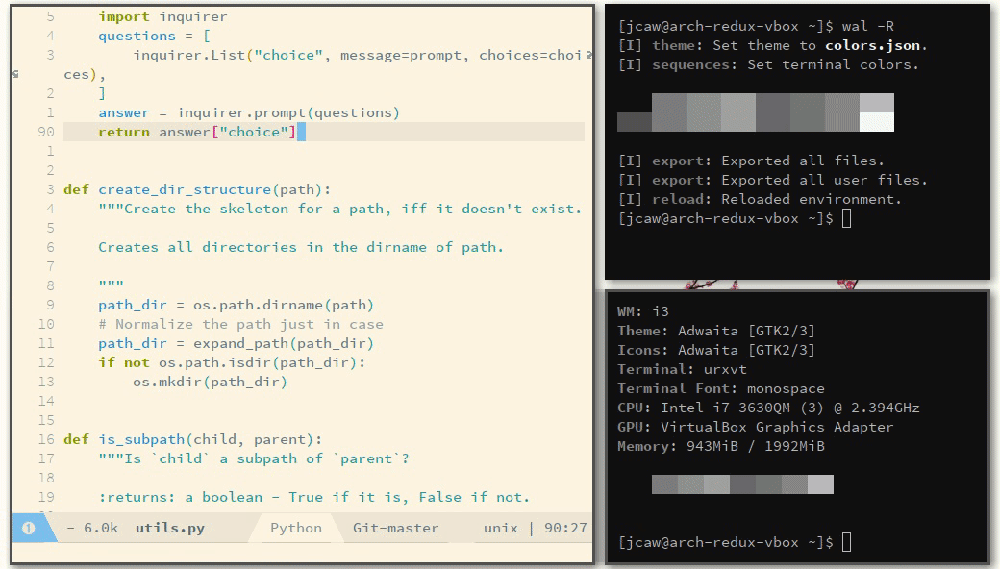

<p align="center">
          
</p>

<p align="center">
          What's the point in an Emacs theme if the rest of Linux looks different?
</p>

<p align="center">
          Apply your Emacs theme to the rest of Linux, using magic.
</p>

---

<p align="center">
          <!-- FIXME: Gif is resized. Looks terrible. -->
          
</p>

## Usage

Just call `M-x` `theme-magic-from-emacs`. theme-magic will extract the colors from your Emacs theme and apply them to the rest of Linux with [Pywal](https://github.com/dylanaraps/pywal).

If you want the Linux theme to update automatically whenever the Emacs theme is changed, call `(theme-magic-enable-auto-update)`. For example:

```emacs-lisp
(require 'theme-magic)
(theme-magic-enable-auto-update)
```

## Installation

First, you must install [Pywal](https://github.com/dylanaraps/pywal) as a dependency. Check if it's installed by calling `wal` in a shell. Make sure Python is installed too.

`theme-magic` is not yet available on MELPA. For now, I recommend installing directly from GitHub with [Quelpa](https://framagit.org/steckerhalter/quelpa). Evaluate the following:
```emacs-lisp
;; Install quelpa
(package-install 'quelpa)
(require 'quelpa)
;; Use quelpa to build the repo
(quelpa '(theme-magic
          :fetcher github
          :repo "jcaw/theme-magic.el"
          ;; You have to explicitly download the python scripts folder
          :files ("*.el" "README.md" "python")))
```

Then require as normal:
```emacs-lisp
(require 'theme-magic)
```

### Restoring Your Theme

[Pywal](https://github.com/dylanaraps/pywal) only applies your theme to the current session. See its documentation for details. To restore the last theme, call `wal -R` in the shell. To restore your theme automatically, add the following to your `.xprofile` (or whichever dotfile is loaded automatically once your desktop starts up):

```shell
wal -R
```

### Setting Your Wallpaper

Pywal was designed to generate a color scheme that matches your wallpaper. If you wish to set a wallpaper, it's best to do that first. Call this command in a shell:

```shell
wal -i "path/to/wallpaper.png"
```

Pywal will set your wallpaper and save it in its cache. Now, apply your Emacs theme:

```emacs
M-x theme-magic-from-emacs
```

Now, when you call `wal -R`, both the wallpaper and the theme will be set.
